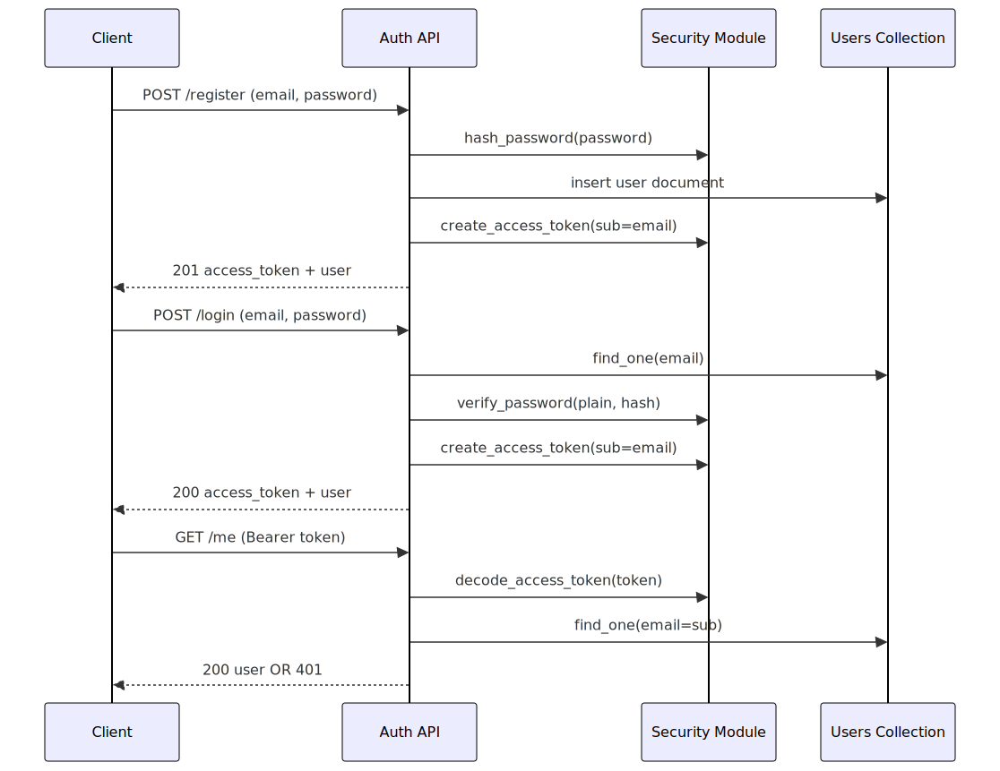

# Yumigura Architecture and Data Model

This document captures the core architecture and data model diagrams for Yumigura.

## 1) High-Level Runtime Architecture

Source: `docs/diagrams/runtime_architecture.mmd`

## 2) Docker Build and Run Flow

Source: `docs/diagrams/docker_flow.mmd`

## 3) Auth (JWT) Request Flow

Source: `docs/diagrams/auth_jwt_flow.mmd`

## 4) Planned Core Data Model (Phase 1)

Source: `docs/diagrams/data_model.mmd`

## 5) Recommended Mongo Indexes

- `users.email` unique
- `organizations.slug` unique
- `organization_members (organization_id, user_id)` unique
- `projects (organization_id, key)` unique
- `project_members (project_id, user_id)` unique
- `issues (project_id, issue_key)` unique
- `issues (project_id, status)`
- `issues (project_id, assignee_user_id)`
- `issues.labels` multikey
