# Developing Yumigura

This guide explains how to run, test, and extend the Yumigura backend locally.

## 1) Prerequisites

- Python 3.11+ (3.13 works with current setup)
- Docker Desktop
- `make`

## 2) Environment Setup

```bash
cd /Users/shivamsinghrawat/Desktop/Yume_Rei/Yumigura
cp .env.example .env
```

Important environment variables:

- `APP_NAME`, `APP_ENV`, `APP_HOST`, `APP_PORT`
- `MONGODB_URL`, `MONGODB_DB_NAME`
- `JWT_SECRET_KEY`, `JWT_ALGORITHM`, `JWT_ACCESS_TOKEN_EXPIRE_MINUTES`

## 3) Local Python Workflow (recommended for development + tests)

```bash
make setup
make run
```

In another terminal:

```bash
make test
```

## 4) Docker Workflow (recommended for service runtime parity)

```bash
docker compose up --build
```



Use this when:

- First startup
- `Dockerfile` changes
- Dependency changes in `requirements.txt`

Stop services:

```bash
docker compose down
```

## 5) Makefile Commands

- `make setup` -> create `.venv` and install dependencies
- `make run` -> run FastAPI app with reload
- `make test` -> run pytest
- `make lint` -> run Ruff checks
- `make format` -> apply Ruff autofixes
- `make up` -> `docker compose up --build`
- `make down` -> `docker compose down`

## 6) Current API Surface

- `GET /` -> API metadata
- `GET /api/v1/health` -> service health
- `POST /api/v1/auth/register` -> create user + issue JWT
- `POST /api/v1/auth/login` -> verify credentials + issue JWT
- `GET /api/v1/auth/me` -> return current user from Bearer token
- `POST /api/v1/organizations` -> create organization (auth required)
- `GET /api/v1/organizations` -> list owned organizations (auth required)
- `POST /api/v1/organizations/{organization_id}/members` -> add/update org member role
- `GET /api/v1/organizations/{organization_id}/members` -> list org members
- `POST /api/v1/organizations/{organization_id}/projects` -> create project (org owner/admin)
- `GET /api/v1/organizations/{organization_id}/projects` -> list projects (org member+)
- `POST /api/v1/projects/{project_id}/members` -> add/update project member role
- `GET /api/v1/projects/{project_id}/members` -> list project members
- `POST /api/v1/projects/{project_id}/issues` -> create issue (project member+)
- `GET /api/v1/projects/{project_id}/issues` -> list issues with filters (project member+)
- `GET /api/v1/projects/{project_id}/issues/{issue_id}` -> get issue by id (project member+)
- `PATCH /api/v1/projects/{project_id}/issues/{issue_id}` -> update issue (project admin/owner)
- `DELETE /api/v1/projects/{project_id}/issues/{issue_id}` -> soft delete issue (project admin/owner)
- `POST /api/v1/issues/{issue_id}/comments` -> add comment (project member+)
- `GET /api/v1/issues/{issue_id}/comments` -> list comments (project member+)

## 6.1) RBAC Summary

- Organization roles: `owner`, `admin`, `member`
- Project roles: `admin`, `member` (org owner has full project access)
- Organization/project membership data is stored in:
  - `organization_members`
  - `project_members`
- Current policy:
  - Org `owner/admin` can create projects and manage members
  - Project `admin` (and org owner) can update/delete issues
  - Project `member` can read/create issues and add comments

## 6.2) Pagination and Sorting

List endpoints support:

- `limit` (default `20`, max `100`)
- `offset` (default `0`)
- `sort_by` (endpoint-specific allowed fields)
- `sort_order` (`asc` or `desc`)

Examples:

```bash
GET /api/v1/organizations?limit=10&offset=0&sort_by=name&sort_order=asc
GET /api/v1/projects/{project_id}/issues?status=To%20Do&sort_by=created_at&sort_order=desc
```

## 6.3) Error Contract

Errors are normalized to:

```json
{
  "error": {
    "code": "http_403",
    "message": "Not allowed"
  }
}
```

Validation errors include `details`:

```json
{
  "error": {
    "code": "validation_error",
    "message": "Request validation failed",
    "details": []
  }
}
```

## 6.4) Audit Events

Important issue/membership mutations write audit events to `audit_events`:

- Organization/project member add or role update
- Issue create/update/delete

Stored fields:

- `actor_user_id`
- `event_type`
- `entity_type`
- `entity_id`
- `payload`
- `created_at`

## 7) Code Structure

- `app/main.py` -> app bootstrap + routers + lifecycle
- `app/core/config.py` -> settings/env parsing
- `app/core/security.py` -> password hashing + JWT helpers
- `app/db/mongo.py` -> Mongo client and database access
- `app/api/health.py` -> health endpoints
- `app/api/auth.py` -> auth endpoints
- `app/api/deps.py` -> API-level dependencies (collections)
- `tests/` -> API tests

## 7.1) Runtime Architecture Snapshot



## 7.2) Mongo Index Initialization

Indexes are created automatically during app startup in:

- `app/db/mongo.py` via `ensure_indexes()`

Current indexes include:

- Unique:
  - `users.email`
  - `organizations.slug`
  - `organization_members (organization_id, user_id)`
  - `projects (organization_id, key)`
  - `project_members (project_id, user_id)`
  - `issues (project_id, issue_key)`
- Query/performance:
  - `organizations.owner_user_id`
  - `organization_members.user_id`
  - `projects.organization_id`
  - `project_members.user_id`
  - `issues (project_id, status)`
  - `issues (project_id, assignee_user_id)`
  - `issues.labels`
  - `issues (project_id, deleted_at)`
  - `comments (issue_id, deleted_at)`
  - `comments.author_user_id`
  - `audit_events (entity_type, entity_id, created_at)`
  - `audit_events (actor_user_id, created_at)`

## 8) Testing Strategy

- Use `fastapi.testclient.TestClient` for endpoint tests.
- Prefer dependency overrides for unit/integration tests that should not require a live database.
- Keep auth, CRUD, and permission tests separate for clear failure diagnostics.

## 9) Common Troubleshooting

1. `ModuleNotFoundError` during tests:
- Cause: running system/conda Python instead of project `.venv`.
- Fix:
  ```bash
  source .venv/bin/activate
  pip install -r requirements.txt
  ```

2. Docker service starts but local tests fail:
- Cause: Docker dependencies do not install into your host Python env.
- Fix: run `make setup` and `make test` locally.

3. API cannot connect to Mongo:
- Verify `MONGODB_URL` in `.env`.
- If using Docker Compose runtime, ensure `yumigura_mongo` is running.

## 10) Next Implementation Target

Phase 2 (Jira-like workflow):

- Custom status definitions and transitions
- Kanban/backlog/sprint entities
- Activity feed views from `audit_events`
